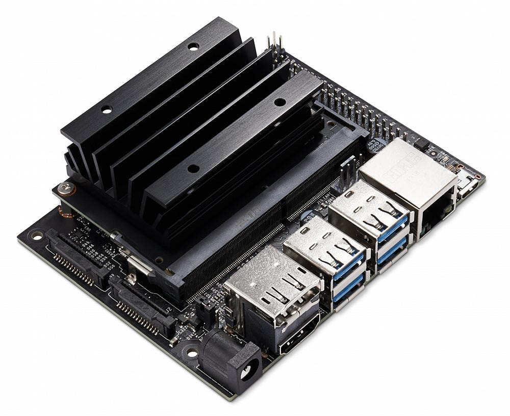
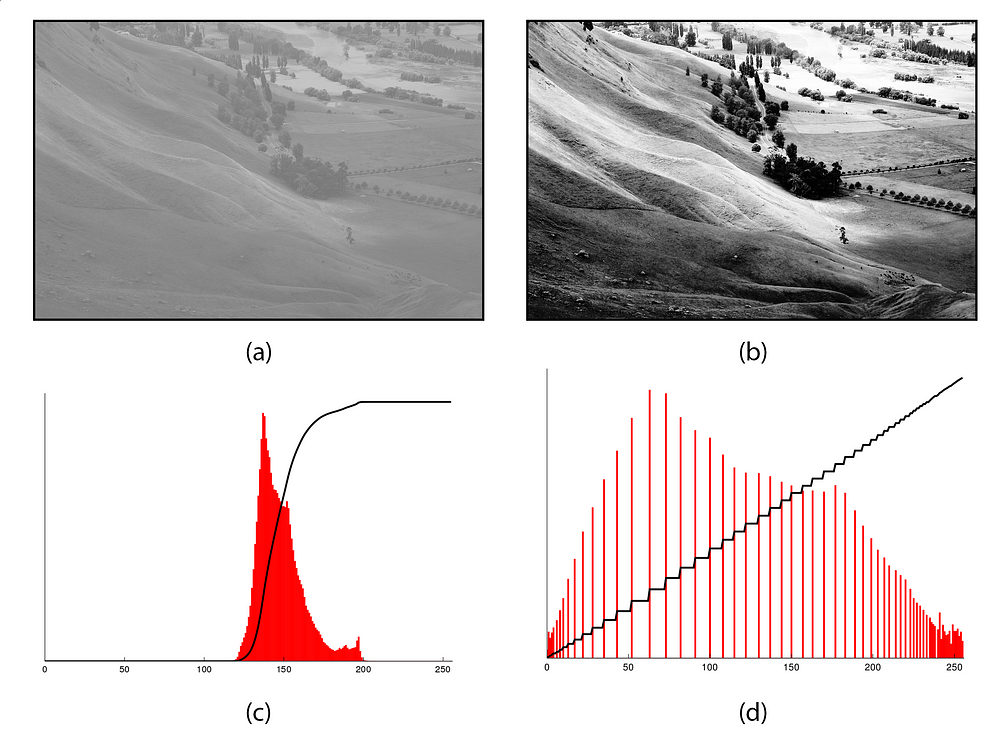
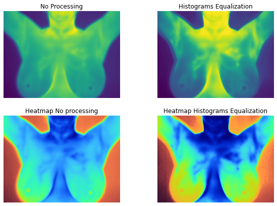

# Detection/Classification of Breast Cancer using thermograpy

## Nvidia Jetson nano developer kit
For this Artificial Intelligence project for breast cancer detection on thermal images I used the Nvidia Jetson Nano developer kit. 
The Nvidia Jetson Nano Developer Kit is a powerful and compact platform specifically designed for embedded artificial intelligence (AI) applications. Featuring a Quad-core ARM Cortex-A57 processor, an NVIDIA Maxwell GPU with 128 CUDA cores, and 4 GB of LPDDR4 memory, the Jetson Nano provides significant computing power for deep learning tasks and image processing. It is particularly well-suited for projects requiring embedded intelligence, such as object recognition, image classification, and other AI-related applications. The user-friendly nature and flexibility of the Jetson Nano make it a popular choice among developers looking to integrate AI capabilities into embedded devices and standalone projects.

## Dataset
In the present investigation, a publicly accessible dataset comprising thermographic images related to breast cancer was employed for diagnostic purposes. This dataset encompasses a total of 3,997images, featuring 3,024 images representing healthy cases and 973 images depicting breast diseases. These images are stored in JPEG format with dimensions of 640x480 pixels. Within the dataset, there are 179 images depicting healthy breast conditions and 101 images corresponding to patients with breast conditions. This dataset was sourced from http://visual.ic.uff.br/dmi/. Sample images from the dataset are provided in below.

## Thermography
At specific temperatures, objects naturally emit thermal signals. The nature of these signals, as well as the temperature range, depends on the characteristics of the object. Under usual conditions, the human body, like other objects, emits Infrared (IR) signals. Due to the heat generated by different bodily functions, the emitted IR signals vary from one region to another. This principle finds frequent application in medical examinations, especially in the context of breast cancer screenings.
Breast cancer development is associated with inflammation and increased blood vessel formation, both of which generate higher temperature profiles. Thermography, often referred to as thermal imaging, offers a non-invasive method for capturing thermal maps of specific body areas in the field of medicine. This approach is contactless, non-destructive, and does not involve radiation, making it suitable for repeated use. In the context of breast cancer screening, a thermographic camera is employed to obtain thermal maps of the breasts and their surroundings, highlighting any anomalies.
The resurgence of thermography in medical applications has brought it into focus as an adjunct to image processing techniques, particularly for the diagnosis of breast cancer. Breast thermography capitalizes on the temperature differences beneath the skin between healthy and cancerous breasts. The presence of a breast tumor raises the temperature of the surrounding tissues. Typically, specialists conduct an asymmetric comparison of healthy and affected breasts.
The process of using thermography for breast cancer screening is relatively straightforward. It commences with a physical examination of the breast's surface, allowing the physician to correlate any abnormalities with the thermal map. Subsequently, the individual is required to spend 15 minutes at room temperature to acclimatize. This is carried out in a controlled environment where both humidity and temperature are regulated. During this period, the individual needs to expose the upper body from the waist to the chin. Once the body temperature reaches equilibrium, the individual is asked to place their hands on their sides for the relevant surfaces to be observed. The imaging procedure is then initiated to complete the process.

## Image processing : Histogram Equalization
Histogram equalization is an image processing technique designed to improve the distribution of grayscale levels in an image. By adjusting the distribution of brightness intensities, this method enhances the overall contrast of the image, thereby improving visibility of details and structures. It is particularly useful in correcting brightness and contrast disparities, enabling a better visual interpretation of images, and finds applications in various fields such as computer vision, object recognition, and medical imaging.

**See in 'Image Processing.ipynb' file of this project.**

## Split Images 70% for training and 30% for test
In the field of image classification, creating a balanced and representative dataset is crucial for effectively training and evaluating models. Ideally, the total set of images is divided into two main parts: a training set, typically representing 70% of the total, and a test/validation set, representing the remaining 30%. The training set is used to train the model, allowing it to learn essential features and patterns in the images. Subsequently, the test/validation set, which has not been seen by the model during training, is used to assess the model's actual performance. This separation ensures that the model can generalize effectively to new data, thereby enhancing its reliability and ability to make accurate classifications in real-world scenarios.

**See in 'Split Images.ipynb' file of this project.**

## Classification of Breast Cancer using thermograpy using pre-trained models
In the realm of image classification, the adoption of pre-trained models represents an innovative strategy leveraging neural networks already trained on extensive datasets. This approach capitalizes on the capability of pre-trained models, such as ResNet18, to extract and comprehend intricate features from a variety of images. ResNet18, in particular, is built upon a residual architecture, introducing direct connections between layers to facilitate the learning of hierarchical representations. The use of pre-trained models allows harnessing prior knowledge gained from similar tasks, providing a more robust initialization for new classification tasks. 
In this story, we delve into the various stages of integrating ResNet18, previously trained on extensive datasets, thereby enhancing its ability to capture intricate information. While we also employ other pre-trained models for image classification, we will confine ourselves to presenting and interpreting the results for these models. Indeed, the method and steps will remain identical to those outlined in the detailed presentation of ResNet18. This approach unveils significant potential across diverse applications, ranging from object recognition to the detection of medical pathologies, underscoring the substantial impact of pre-trained models in the field of computer vision.
Installation and prerequisites
On this project it is necessary to install and import the following Python libraries:
- os (already present when you install Python)
- random (already present when you install Python)
- time(already present when you install Python)
- copy (already present when you install Python)
- numpy
- pandas
- cv2 (opencv)
- matplotlib
- seaborn
- sklearn
- torch (Pytorch)
- torchvision

## Train Model

**For more details go to each file to see how I use each pre-trained models and what are the results**

## Criticism of the model and the dataset

## Conclusion

## Future prospects
